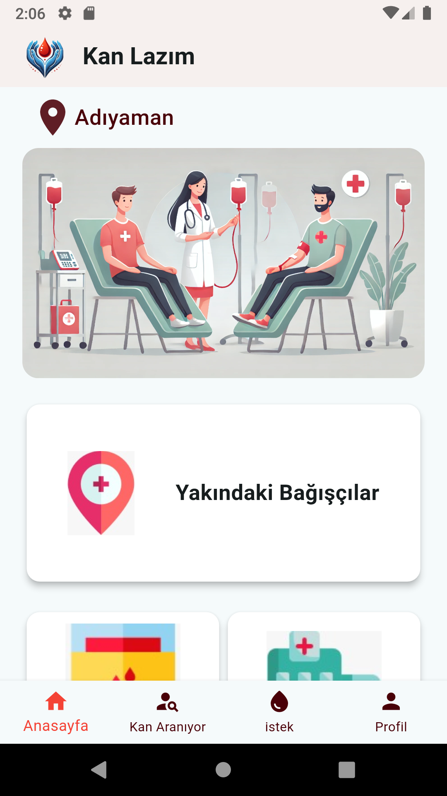
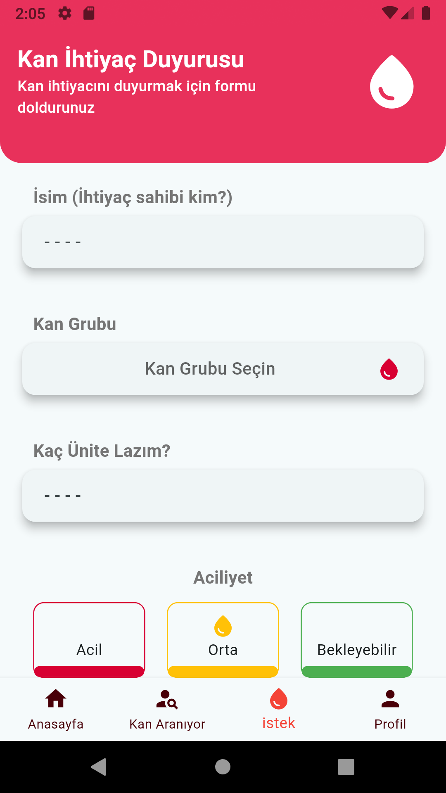
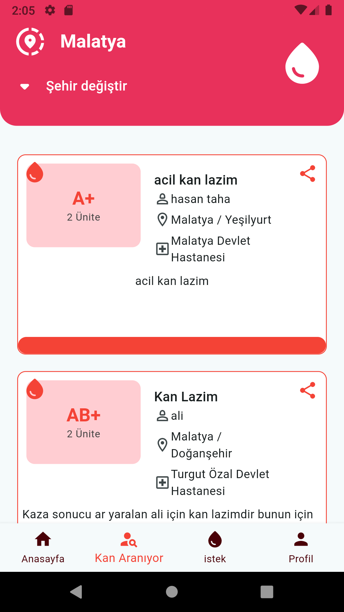

# Kan Lazım - Mobil Uygulama

Kan Lazım, acil kan ihtiyacını karşılamak amacıyla kan bağışçıları ile ihtiyaç sahiplerini güvenilir ve hızlı bir şekilde buluşturan bir sosyal sorumluluk projesidir. Bu mobil uygulama, kullanıcıların kan taleplerini oluşturmasını, bağışçıların bu talepleri görüntülemesini ve ihtiyaç sahiplerine ulaşmasını sağlar.

## 📱 Özellikler

- **Kan Talebi Oluşturma:** Kullanıcılar, acil kan ihtiyaçlarını uygulama üzerinden kolayca oluşturabilir.
- **Kan Talebi Görüntüleme:** Bağışçılar, yakınlarındaki kan taleplerini görüntüleyebilir.
- **Konum Bazlı Eşleştirme:** Kullanıcıların konum bilgisine göre en yakın kan bağışçılarını ve kan ihtiyacını bulur.
- **Gerçek Zamanlı Bildirimler:** Yakınınızdaki kan ihtiyaçları için anında bildirim alabilirsiniz.
- **Hızlı İletişim:** Kan ihtiyacı olan kişiler ile bağışçıları hızlı bir şekilde iletişime geçirir.

## 🚀 Kurulum

Bu projeyi yerel ortamınızda çalıştırmak için aşağıdaki adımları izleyin:

### 1. Gereksinimler

- Flutter SDK: [Flutter Kurulumu](https://flutter.dev/docs/get-started/install)
- Android Studio veya Visual Studio Code (Flutter ile uyumlu IDE)
- Git: [Git Kurulumu](https://git-scm.com/downloads)

### 2. Projeyi Klonlayın

Terminal veya komut istemcisinde aşağıdaki komutu çalıştırarak projeyi klonlayın:

```bash
git clone https://github.com/kanlazim/mobile-app-flutter.git
```

### 3. Bağımlılıkları Yükleyin

Proje dizinine gidin ve Flutter bağımlılıklarını yükleyin:

```bash
cd mobile-app-flutter
flutter pub get
```

### 4. Çalıştırma

Uygulamayı bir emülatörde veya fiziksel cihazda çalıştırmak için aşağıdaki komutu kullanın:

```bash
flutter run
```

## 📸 Ekran Görüntüleri

| Ana Sayfa                            | Kan Talebi Oluşturma                               | Kan İhtiyaçlarını Görme                                    |
| ------------------------------------ | -------------------------------------------------- | ---------------------------------------------------------- |
|  |  |  |

## 🤝 Katkıda Bulunma

Bu projeye katkıda bulunmak isterseniz, lütfen aşağıdaki adımları izleyin:

1. Bu repository'yi forklayın.
2. Yeni bir dal (branch) oluşturun: `git checkout -b yeni-özellik`
3. Yaptığınız değişiklikleri commit edin: `git commit -m 'Yeni bir özellik eklendi'`
4. Dalınıza (branch) push yapın: `git push origin yeni-özellik`
5. Bir **Pull Request** açın.
